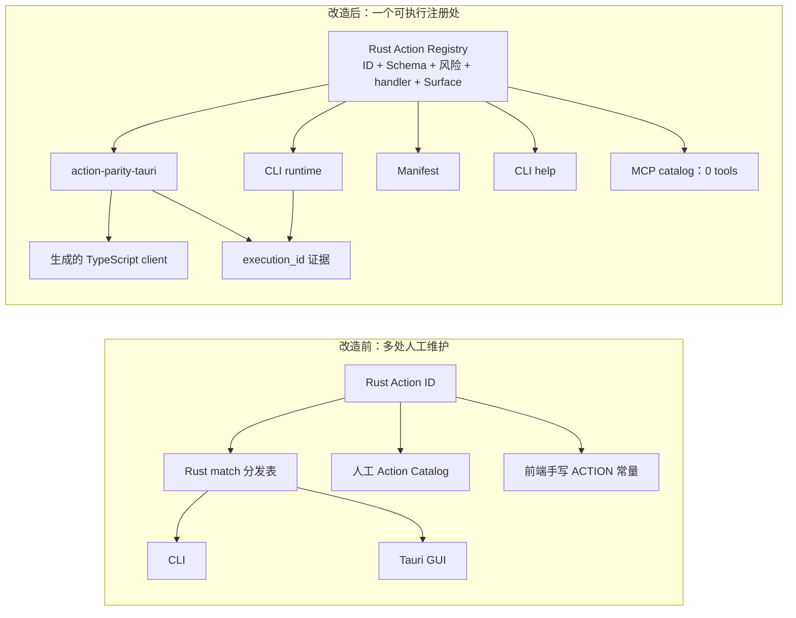

# Redline ActionParity 可执行接入报告

> 日期：2026-08-01；项目：Redline 0.1.0；接入目标：验证 ShadowCore / ActionParity 是否让真实 Tauri + Rust 项目更容易被 Claude Code、Codex、Hermes 等 AI 编程工具理解、调用和测试。

## 结论

这次接入证明了最有价值的路径不是再手写一份 Manifest，而是把现有 Rust 动作核心升级为可执行 Action Registry，并让 GUI、CLI、生成器和验证器都调用它。

Redline 现在有：

- 9 个真实 CLI Action；
- 4 个当前确实被 GUI 调用的 Action；
- 0 个 MCP Tool——因为还没有 MCP 运行时，生成器不会伪造覆盖；
- 9/9 必需 CLI Binding 和 4/4 可选 GUI Binding 到达同一 Registry 的执行证据；
- 可从任意子目录发现的 `action-parity.config.json`，供 AI 编程工具直接读取。

## 改造前后



旧的 Rust `match` Action 分发表和 65 行手工 Action 清单已删除。Action ID、描述、输入 Schema、风险、Surface 范围与 handler 映射现在只在 `crates/redline-core/src/registry.rs` 注册。

## 量化结果

| 指标 | 接入前 | 接入后 |
|---|---:|---:|
| Rust Action-to-handler 分发表 | 1 个旧 `match` + 1 份描述清单 | 1 个可执行 Registry |
| 前端手写 Action ID 字面量 | 9 | 0 |
| 手写 Manifest 行数 | 0（没有 Manifest） | 0（467 行全生成） |
| 生成文件 | 0 | 5 个、1,670 行、约 45.7 KB |
| CLI Action | 9 | 9 |
| 真实 GUI Action | 4 | 4 |
| MCP Tool | 0 | 0 |
| 可执行 Binding 证据 | 0 | 13/13 |
| 核心 Rust 测试 | 41 | 44 |
| Agent 可发现的完成命令 | 无 | `pnpm run action-parity:verify` |

生成物包括 467 行 Manifest、300 行 CLI 帮助、127 行 TypeScript client、3 行空 MCP Catalog，以及用于确定性重放的 Registry Bundle。它们全部由 258 行 Registry 源文件派生，不接受人工编辑。

最关键的节省不是总行数减少，而是维护方向改变：新增 Action 时，开发者只实现业务 handler、在 Registry 注册契约，并在确实需要时增加 GUI 呈现；不再同步编辑 Manifest、前端 Action 常量、CLI 目录和 MCP 描述。

## AI 工具的最短路径

AI 编程工具进入仓库后只需运行：

```text
pnpm exec action-parity context . --json
```

返回值明确告诉 Agent：

- 唯一真相源是 `crates/redline-core/src/registry.rs`；
- `apps/redline-desktop/src/generated/` 不可编辑；
- 每个 Action 的输入 Schema、风险和真实 Surface；
- 生成、漂移检查和可执行验证命令；
- 完成标准是 `verified: true`，不是“测试文件名存在”。

因此 Agent 不需要先通读数百行规范，也不需要从按钮文字或截图猜业务入口。

## 可执行证据

`tests/action-parity-bindings.test.mjs` 从生成 Manifest 派生动作集合，不再维护另一份 Action 列表：

1. 构建真实 `redline-cli`；
2. 对 9 个 CLI Action 逐一传入唯一 `execution_id`；
3. 通过真实 `action-parity-tauri` Adapter 调用 4 个 GUI Action；
4. 比较请求 ID 与 Registry 返回的核心执行 ID；
5. 输出可重放 observations；
6. `action-parity verify` 记录 Git 状态、操作系统、Node 版本、命令、退出码、耗时、二进制 SHA-256 和报告 SHA-256。

证据调用写动作时使用空输入，只验证路由并在参数闸门处结束，不会写源文件或输出文件。
另外做过一次故意漂移实验：把生成 client 的 `agent.catalog` 手改后，
`action-parity:check` 明确将该文件报告为 `drifted` 并以退出码 1 失败；重新生成后恢复全绿。

## 真实接入暴露的上游问题

Redline 不是只验证了顺利路径，也直接推动了上游修正：

1. 9 个 Action 乘所有 Surface 会生成虚假 GUI/MCP 覆盖，因此 SDK 增加了 per-Action Surface scope。
2. scope 一度能遗漏全局必需 Surface，因此 SDK 现在在两种注册顺序下都快速失败，渐进迁移必须写明 optional 与排除理由。
3. `doctor` 目前仍把 Registry 与生成 TypeScript 中相同的 ID 报成漂移风险。这是误报，说明 Doctor 下一步必须读取 Agent Profile 的 `generated_paths` 并排除生成物。
4. 第一轮 Linux CI 发现 `C:/Windows/evil.dll` 只会在 Windows 主机上被 `Path::components()` 识别成绝对路径。现在归档安全闸门会在所有平台显式拒绝 Windows 盘符、UNC、Unix 根路径与父目录跳转。

第三点应在上游修复后加入回归测试。第四点证明干净跨平台 CI 不只是发布手续，它能找到单平台开发机看不到的安全问题。真实项目的作用正是让工具链的错误比开发者更早暴露。

## 尚未完成与不能夸大的部分

- GUI 只暴露 4/9 Action，因此 GUI 被明确标成 optional；不能宣称 GUI 全动作一致。
- 输出 Schema 目前仍是通用 object，TypeScript 已生成输入类型，但输出类型需要下一轮把 Rust 返回值类型化。
- MCP Catalog 正确为空；只有真实 MCP server 接到同一 Registry 后才能声明 MCP Surface。
- 当前证据达到 AP-2 runtime verified；跨设备状态版本、幂等与冲突处理仍属于后续 AP-3 工作。

这份试点的采纳理由可以量化为：第二个界面不再要求复制动作目录与协议对象，AI 工具能用一个 JSON 上下文找到真相源，并用一个命令证明 13 条真实绑定没有漂移。
